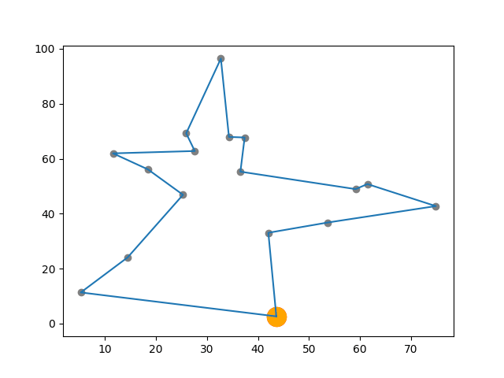

# SVRP_MATH7202
A repository for the University of Queensland Advanced Operations Research (MATH7202) project. 

Authors: David Banh (42662789), Cameron Gordon (42370057). 

The project investigates the Vehicle Routing Problem with Stochastic Requests (VRPSR). The performance of a number of heuristic and simulation based models are examined for the problem. The most effective is a Grid-Based Monte Carlo Tree Search Algorithm. 

The original problem formulation is based on [Ulmer M.W. (2017) Anticipation in Dynamic Vehicle Routing](https://www.researchgate.net/publication/325372734_Anticipation_in_Dynamic_Vehicle_Routing). 

